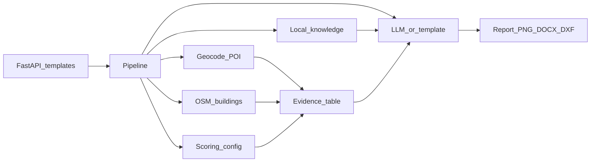

# 奶茶店选址 AI 分析评估助手：第一期实施计划

**准绳：** `[产品需求文档.md](E:\cursor experiment\商圈选址可行性简报\产品需求文档.md)` **V1.3**。口头讨论未写入 PRD 的内容，以本文「铁律」为准。冲突时：**PRD > 本计划 > 自行发挥**。PRD 未写清时先问用户，不要加功能。

**给下一会话的第一句话（建议贴到新对话）：**

> 严格按 `产品需求文档.md` V1.3 和本计划实现第一期 Web。只做一期。禁止爬虫、禁止编造、不要做 Grasshopper。无 Key 必须能跑通 ≥2 个演示点。未填租金仍可「推荐选址」但必须「财务未核」。

---

## 铁律（换对话也不得违反）

1. **禁止编造。** 无接口返回、用户未填、知识库未命中 → 写「信息不足 / 需实地」。禁止假店名、假客流、假回本、假评价观点。
2. **分数由程序打。** LLM 不得另打 82 分或改建议档。建议档只来自计分模块 + 否决规则。
3. **每条结论带证据 ID。** `claim_id → evidence[] → source（接口/查询半径/条数/时间或 demo）`。
4. **失败要降级，不可静默造假。** Key 无效：人话报错或改演示点，不许用假 POI 填报告。
5. **密钥不上仓库。** `.env` gitignore；用户表单 Key 只进当次内存，不写库、不写日志。
6. **不爬** 大众点评 / 美团 / 高德网页。评价正文不要。官方周边搜索若返回餐饮 `rating` 则用；没有就写未返回。
7. **本期只做 Web。** 不做 Rhino/GH/CAD 插件、MCP RAG、企业向量库、登录账号、前后端两套部署。
8. **公开默认演示数据**，避免路人消耗运营方高德次数。任意真点 = 用户自己填 **Web 服务** Key（与 JS Key 不是同一种）。
9. **人群分析要做，但诚实：** POI 场景代理 + 官方 rating（有则用）。不是用户画像，不是客流估算。
10. 产品对外名：**奶茶店选址 AI 分析评估助手**；核心产出仍是完整可行性报告。

---

## 本期交付（验收口径）

用户打开 **一个网址**（以后可做成二维码，二维码只是 URL）：

- 输入城市 + 地点名（联想）→ 地图落点可拖拽；经纬度只在角落显示。
- 选填：面积、月租、品牌定位、客单价、预估月营收、预估日杯量、高德 Web Key、可选 LLM Key。
- 一键生成 **完整报告**（10 章，默认先看决策摘要），网页显示分析图 PNG，下载 Word / PNG / DXF。
- **无任何 Key：** ≥2 个预置演示点完整跑通（含下载）。
- 无 Key 且非演示点：不生成假周边，提示填 Key 或改演示点。

**开发验收：** 演示 2 点通；正文数字与证据清单/地图一致；未填租金可出「推荐选址」且财务未核文案必现；综合分与页面一致。

**用户价值（试用时人工看，不编 DAU）：** 10 分钟内能说出三档建议+一条原因；能发现至少一条对得上证据的风险；能指出分来自需求/竞争/场景/成本哪一块。

---

## 架构（一个进程，模块分开）

固定流水线（工具型 Agent，禁止模型自己决定调哪些工具）：

1. 地理编码 / 或加载演示包
2. 周边 POI（茶饮、配套、交通；`extensions=all` 尝试 `rating`）
3. OSM 建筑轮廓（失败则图降级并说明，不编建筑）
4. 压成特征表 + 程序计分 + 否决
5. 按章节+场景标签检索知识库
6. 每章只喂该章证据，生成正文
7. 组装报告 + PNG + DOCX + DXF

任一步失败：该步降级，后续不得脑补该步数据。

**无 LLM Key：** 用槽位模板把证据表填进各章（仍禁止编造）。演示点必须在无高德、无 LLM 时也能出完整报告。

---

## 建议目录（空仓库从零建）

仓库根：`E:\cursor experiment\商圈选址可行性简报`

- `app/main.py` — FastAPI：页面、生成、下载、输入提示代理、限流  
- `app/pipeline/` — geocode、amap_poi、osm、features、scoring、rag、generate、export_docx/png/dxf  
- `app/prompts/` — 系统提示：先证据后结论；只能用证据表中的店名和数字  
- `config/scoring.yaml` — 权重、分档、否决、75/55 阈值（改阈值只改此文件）  
- `知识库/` — 结构化短文 + YAML 头（`scene`/`chapter`/`source`）  
- `data/demo/` — 至少 2 个脱敏演示点 JSON（过密商场、偏空社区）；另备第 3 点作评测  
- `data/eval/` — 3 个固定点的检查清单（期望：必须提到过密 / 不得写成核心商圈 等）  
- `.env.example`、`.gitignore`、`README.md`（小白可运行：venv、uvicorn、演示按钮）

图层名（Web/DXF 共用，二期 GH 将沿用，本期只定名不写插件）：`SITE_POINT`、`R300`/`R500`/`R1000`、`COMPETITORS`、`TRANSIT`、`BUILDING_FOOTPRINT`。图例写清「半径圆，非路网等时圈」。

---

## 计分（必须写成 `scoring.yaml` + 纯函数）

原则：成功概率 ≈ 需求匹配 35 + 竞争环境 30 + 消费场景 15 + 成本风险 20。需求和竞争最高。

**竞争（30），300m 茶饮家数：** 0–2 高；3–5 中高；6–8 中；9+ 低。0 家且 500m 餐饮配套也极弱 → **需求分必须低**，禁止空白地带满分。

**需求（35）：** 500m 内商场/学校/办公/社区/交通/餐饮结构 vs 茶饮场景；用户填了品牌定位则对照，未填按「即时饮品、年轻向」。

**消费场景（15）：** 餐饮/休闲配套 + 地铁/公交远近。路径规划失败则只用直线距离并注明。

**成本（20）：** 仅当已填月租 **且**（客单价或预估月营收）时计分。租金/营收 >30% 否决不推荐。未填：本项未评分，总分由已评分项 **折成百分制**，第一页必须：

> 财务未核：用户未提供租金等经营信息，本结论未包含能不能赚钱；仍建议结合租金与实地测算谨慎决策。

**否决（优先于分数）：** 300m 茶饮 ≥9 → 最高「谨慎选址」；已填财务且租金占比 >30% → 不推荐；需求过低（500m 几乎无商场/学校/办公/社区/交通/餐饮）→ 不推荐。

**分到建议：** 75–100 推荐选址；55–74 谨慎；0–54 不推荐。未填租金 **仍可推荐**，不得强制降为谨慎。

报告注明：综合分为本工具规则，非法定标准。

决策摘要：评分、三档建议、核心原因/风险（有几条写几条）、可执行下一句、财务未核（若适用）。

---

## 数据与 RAG

**高德（用户或 .env 的 Web 服务 Key）：** 输入提示、地理编码、周边搜索（300/500/1000）、可选步行路径。个人认证搜索额度有限 → 演示模式零搜索。

**OSM Overpass：** building 轮廓；按格网短时缓存；国内可能稀疏，必须披露。

**知识库（实施时公开检索后写成我们自己的短文，带来源，禁止整本搬运咨询报告）：** 选址指标；商场/社区/交通店选铺原则（原则不是现场事实）；报告章节；财务公式与租金经验线（非国标）；竞品思路；三日蹲点；有效人流≠过路；保本杯量；租约风险；常见连锁名单；300/500/1000m 习惯。

**禁止入库冒充能力：** 入住率≥85% 当数据、真实排队、街道收入、点评语料、信令画像。

检索：章节 + 场景标签过滤；命中文档名可在折叠「本次知识库引用」中展示。检索错篇用标签修，不靠把 Prompt 写得更「专业」。

**不安装 MCP RAG。**

---

## 界面与导出

- 输入区 + 演示点 A/B 按钮；Key 密码框并说明须为 Web 服务 Key。  
- 结果：10 章锚点/页签；地图叠点与圈；折叠证据与 RAG 命中。  
- 下载：docx（含图）、png、dxf。无「请再导入 CAD」文案。  
- 限流；日志只记次数与错误码，不含 Key、不含经营数字明文。  
- 手机能读摘要/风险/下载；完整地图以桌面为准。二维码 = 部署后的同一 URL，本期实现页面即可，不必先做扫码图。

---

## 实现顺序（对应里程碑 M1–M4，本期无 M5）

1. **脚手架：** FastAPI、模板、`.env.example`、gitignore、README。
2. **M1：** 演示 JSON → 特征表 → 计分/否决 → 10 章骨架（模板填槽）+ 数据说明固定段。
3. **知识库短文** 写入 `知识库/` + 简单检索。
4. **M2：** 高德/OSM 真链路；分析图 PNG + DXF；Word。
5. **LLM 路径：** 有 Key 才调用；Prompt 锁死证据；与模板路径同一套 JSON 报告结构。
6. **M3：** 3 点评测脚本或手工清单（期望检查项）；改 Prompt/阈值可对比。
7. **M4：** 本地可运行；README 写清公网部署后即可贴二维码。不强制本期上云（无账号则先本机演示）。

---

## 明确不要做

爬虫；MCP；企业 RAG；GH/CAD 主流程；Figma/Blender/ComfyUI/Revit；第二业态咖啡 UI；登录/云端报告库；预测月营收；政策新闻进分；客流估算；把讨论当「已经做完 Prompt A/B」（代码里先落系统提示；A/B 对比用 3 个固定点后再做）。

---

## 下一会话注意事项

- 用户是电脑小白：README 逐步；聊天里可讲知识点，**不要**把教学写进产品 UI。  
- 演示数据必须是 **自造/脱敏结构**，不要把高德批量结果原样进 Git。  
- 实现中每做完一块用演示点点一次，优先保证「无 Key 全流程」。  
- 修改评分只改 `scoring.yaml`，并在 `data/eval` 留改前改后说明（面试讲「校准阈值」）。

